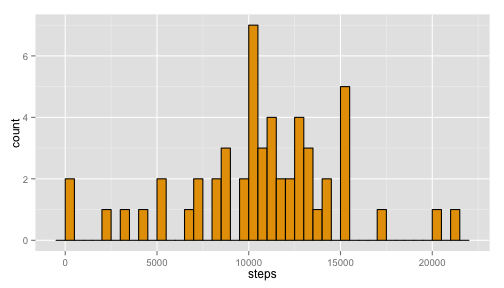

# Reproducible Research: Peer Assessment 1


## Loading and preprocessing the data

The data is first unzipped and stored in the *data* directory. The resulting csv
file is then read into a data frame using the `read.csv` function.

```r
# Create a directory to store data, if one doesn't already exist
if(!file.exists("data/")){
    dir.create("data/")
}

# Unzip the data file
unzip(zipfile = "activity.zip", exdir = "data/")

# Load the data and create data frame 'activityDat'
activityDat <- read.csv("data/activity.csv")

# Remove missing values for the first part of the assignment
activityDatNonNA <- activityDat[!is.na(activityDat$steps), ]
```

Use the `ddply` function from the `plyr` library to create a new data frame with
the number of steps listed by day.

```r
library(plyr)
dailyActivity <- ddply(activityDatNonNA, ~ date, summarize, 
                       steps = sum(steps))
```


## What is mean total number of steps taken per day?

Make a histogram of the total number of steps taken each day

```r
library(ggplot2)
ggplot(dailyActivity, aes(x = steps)) + 
    geom_histogram(aes(y = ..count..),
                   binwidth = 500, colour = "black", fill = "#E69F00")
```



Calculate and report the mean and median total number of steps taken per day

```r
dailyMean <- mean(dailyActivity$steps)
dailyMed <- median(dailyActivity$steps)
```
The mean total number of steps taken per day is 
10766.19.  
The median number of steps per day is 10765.

## What is the average daily activity pattern?

Make a time series plot (i.e. type = "l") of the 5-minute interval (x-axis) and 
the average number of steps taken, averaged across all days (y-axis)


Which 5-minute interval, on average across all the days in the dataset, contains
the maximum number of steps?


## Imputing missing values

Calculate and report the total number of missing values in the dataset (i.e. the
total number of rows with NAs)


Devise a strategy for filling in all of the missing values in the dataset. The
strategy does not need to be sophisticated. For example, you could use the 
mean/median for that day, or the mean for that 5-minute interval, etc.


Create a new dataset that is equal to the original dataset but with the missing
data filled in.


Make a histogram of the total number of steps taken each day and Calculate and
report the mean and median total number of steps taken per day. Do these values
differ from the estimates from the first part of the assignment? What is the
impact of imputing missing data on the estimates of the total daily number of 
steps?


## Are there differences in activity patterns between weekdays and weekends?

Create a new factor variable in the dataset with two levels – “weekday” and 
“weekend” indicating whether a given date is a weekday or weekend day.


Make a panel plot containing a time series plot (i.e. type = "l") of the 
5-minute interval (x-axis) and the average number of steps taken, averaged
across all weekday days or weekend days (y-axis). The plot should look
something like the following, which was creating using simulated data:


